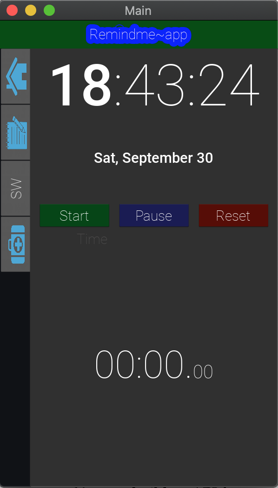

# RemindMeApp

This is an app developed with Kivy that acts as a reminder. You can set some events and the app will play a sound when it's time.

## Features

## Configuration Page

- Set time and days for the alarm to be triggered
- Set a label for the even.

## Reminder List Page

- List all reminders. The following things are listed for a reminder
  - Label
  - Time
  - event status, if active or not
  - event status, if passed or pending.

## Stopwatch Page

This page contains a clock that runs base on your system's time zone, and a stopwatch for timing tasks.

## Future Features

The app is still very young and under development. Here are some features that I am working on

- Select between popup and/or different sounds for the alarm
- Validation of the configuration page entries.
  - Time entered should be checked
  - The `Add` button shouldn't be active if required fields are not entered
- A reminder can be added with a break length. Just like the pomodoro technique, we should have a count-down prior to the alarm been triggered.
- The homepage can show a maximum of 2 events. The event that just got triggered, with it's count-down if applicable, and the up-coming event. Then a small button is provided that shows all passed events in a popup.
- A search form in the `Reminder List Page` to search events.
- Filters to filter by `passed`, `pending`, `active`, `inactive`
- Ways to edit events from the `Reminder List Page`: We could have buttons to delete, activate and inactivate from the list page, but for edit, once we press the edit button, it should take us to the configuration page with all information pre-filled, ready to be edited.
